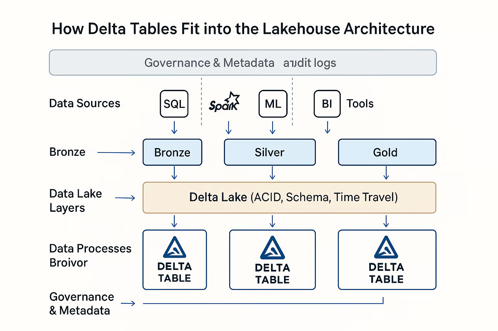

## 1. Prerequisites

### Databases

#### Principle: ACID

- **Atomicity:** Transactions are all-or-notmagick mogrify -format avif *.*hing.
- **Consistency:** Data always follows defined rules.
- **Isolation:** Transactions do not affect each other.
- **Durability:** Changes persist after commit.

#### Joins

- INNER JOIN: only matching rows from both tables.
- LEFT [OUTER] JOIN: all rows from the left table, matching rows from the right table (NULLs if no match).
- RIGHT [OUTER] JOIN: all rows from the right table, matching rows from the left
- FULL [OUTER] JOIN: all rows from both tables, NULLs where no match.

#### ETL: Medallion architecture

ETL (extract-transform-load) is standard for large-scale data processing. Medallion architecture divides data into three layers:

- **Bronze:** Raw data loaded into the system, e.g., CSV loaded into a delta table. No transformation, so you can always check what was in the original data.
- **Silver:** Cleaned and standardized data (e.g., parsed dates, deduplication, renamed columns, joined tables).
- **Gold:** Final business outputs (e.g., dashboard-ready tables, application queries).

#### CDC

**Change Data Capture** policy or **slowly changing dimensions**. Technique to track and capture changes in data sources

1. Type 1: Overwrite old data with new data (no history).
2. Type 2: Keep history by adding new records with timerange when they are valid.

### Cloud: object storage

Standard storage for large files (`csv`, `json`, images, videos, etc.). There can be organizes in folders. Cheap, scalable, and accessible. No practical size limits.

### Java

JVM: Java Virtual Machine. Required for running Spark and Scala.
Scala: Modern multiparadigm programming language running on the JVM. Used for Spark core.

### Memory representation

**Parquet files**: Highly efficient binary table data format. Efficiency is thanks to columnar organization.
A column is stored as one line, so you can read just one column and ignore others. Uses data types.

**Apache arrow**: In memory columnar data format. Efficient for data exchange between systems (e.g., Pandas, Spark, etc.). Minimizes serialization/deserialization overhead. There is also  a Python library `pyarrow`.

Parquets are for storage on disk. Arrow is for in-memory data exchange. Both are columnar formats.

### Delta table

A structure that uses parquet files to efficiently work with large tables and brings ACID principles.

The principle is that there are parquet files and a log. So you can very efficiently add, for example, new data. You first add a new parquet file with new data and then write to the log that the table contains one more parquet file. The log even allows you to use time travel functionality, so you can easily revert some operations.

Physical partitioning (Parquet files) enables efficient parallel processing. Only relevant partitions are read and processed.

Delta tables are typically stored in blob storage. Schema is flexible; columns can be added as needed.

Big data workloads are mostly append-only (e.g., sensor data, web logs). Frequent updates are rare compared to traditional databases.

{width=400}
