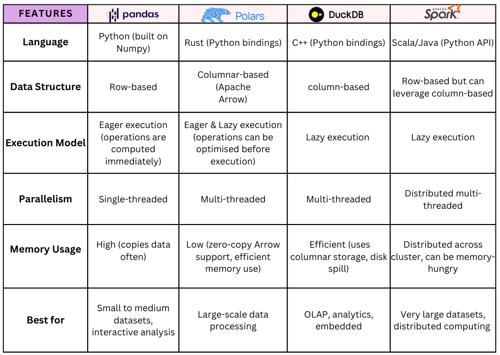

## 2. PySpark

Spark is an Apache technology for distributed computing, even on weak hardware. It uses JVM and Scala. PySpark is the Python interface to it.

Uses map-reduce: tasks are split, processed in parallel, and results are combined. Designed for clusters and large datasets.

### Comparison to other solutions

Spark has significant performance overhead when starting the runtime and splitting the main task. Of course, the best results are in large clusters.

Simple rules:

- Polars are better than pandas (multithreaded, lazy evaluation).
- Polars and DuckDB are suitable for single machine workloads—data size up to a few gigabytes max.
- PySpark excels in cluster infrastructure with terabytes of data.
- Single machine PySpark is suitable for testing, but not practical for production.



### Basic functionalities

PySpark allows two main options for working with data:

- SQL queries (via temporary views).
- DataFrame API (Pythonic, lazy evaluation).

### SQL

Create a temporary view for SQL queries:

```python
df: DataFrame = ...
# We need to create a name to query in SQL
# this is only a shortcut so the operation is quick
df.createOrReplaceTempView("my_table_name")
sql = """
SELECT * FROM my_table_name WHERE age > 30;
"""
result = df.sparkSession.sql(sql)
```

Useful SQL commands:

```SQL
DESCRIBE HISTORY my_table_name; -- show delta log

DROP TABLE IF EXISTS my_table_name;

SELECT count_if(email IS NULL) FROM users_dirty;
SELECT count(*) FROM users_dirty WHERE email IS NULL;

SELECT DISTINCT(*) FROM users_dirty;
```

Python alternatives:

```python
usersDF.selectExpr("count_if(email IS NULL)")
usersDF.where(col("email").isNull()).count()

usersDF.distinct().count()
```

Usefull functions:

```SQL
date_format(col, "HH:mm:ss")
regexp_extract(email, "(?<=@).+", 0)
CAST col AS STRING
```

### Python

DataFrames are lazy, so every operation is stored in a directed acyclic graph (DAG) and evaluated only with operations like: `save`, `show`, `display` etc.

#### Load and save

```python
from pyspark.sql import SparkSession
from pyspark.sql.functions import *

# Create SparkSession
spark = SparkSession.builder \
            .appName('SparkByExamples.com') \
            .getOrCreate()
            
# Create dataframe
data=[
    ["1","2020-02-01"],
    ["2","2019-03-01"],
    ["3","2021-03-01"]
]
df=spark.createDataFrame(data, ["id","input"])
df.printSchema()
df.count()
df.show(10, truncate=False)

# Load dataframe
df1: DataFrame = spark.read.format("csv")
    .option("header", True)
    .option("inferSchema", True)
    .load("path-to-file.csv")
# overwrite is equal to DROP TABLE IF EXISTS
df1.write.format("delta").mode("overwrite").save("path-to-delta-dir")
df1.write.mode("overwrite").saveAsTable("table_name")

df2 = spark.table("table_name") # load table
```

#### Select

```python
from pyspark.sql.functions import col, split, to_timestamp, when

df.select(col("col1_name"))
df.where(col("age") > 30)
df.filter((df.age > 25) & (df.department == "Engineering"))
df.filter(col("department").like("MARKETING"))
df.filter(col("name").startswith("A"))
df.withColumn("price_sum", col("amount") * col("price_per_item"))
df.withColumn("start_at", to_timestamp(col("start_at_str")))
df.withColumnRenamed("name", "full_name")

# Select columns dynamically
columns_to_select = ["name", "department"]
df.select(*columns_to_select)

df.withColumn(
    "salary_category",
    when(
        col("salary") < 60000, "Low"
    ).when(
        (col("salary") >= 60000) & (col("salary") < 90000), "Medium"
    ).otherwise("High")
)

# Add multiple columns at once
df = df.withColumns({
    "bonus": col("salary") * 0.1,
    "net_salary": col("salary") - (col("salary") * 0.2)
})
df = df.drop('column1', 'column2', 'column3')
```

#### Joins

```python
df3.join()
df3.join(df, on=df1["col1_id"] == df2["col_link_id"], how="inner")
```

#### Testing

```python
from pyspark.testing.utils import assertDataFrameEqual, assertSchemaEqual

# actual, expected
assertSchemaEqual(df1.schema, df2.schema)
assertDataFrameEqual(df1, df2)
```
